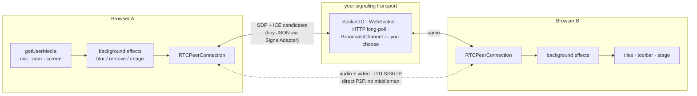
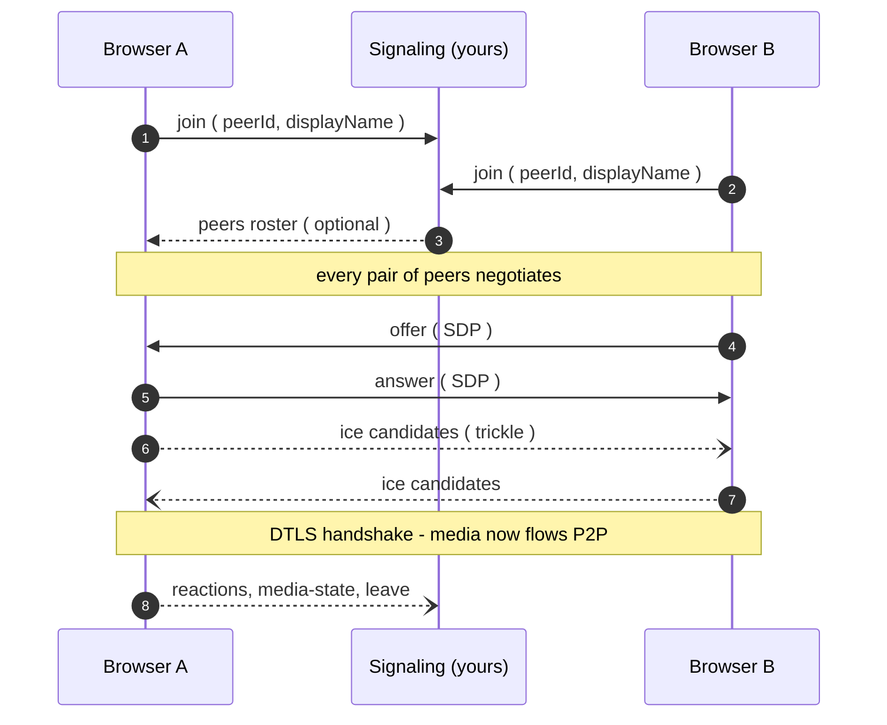

<div align="center">

# 🎥 kapi

### Peer-to-peer video calls in the browser — no media server required

[](https://www.npmjs.com/package/@vn-thanh/kapi)
[](https://github.com/vn-thanh/kapi/actions/workflows/ci.yml)
[](https://bundlephobia.com/package/@vn-thanh/kapi)
[](LICENSE)

**WebRTC mesh rooms in ~10 lines.** Bring your own signaling — Socket.IO, WebSocket, HTTP long-poll, BroadcastChannel, anything that can relay JSON. Optional client-side background blur / removal via MediaPipe. Ships a full meeting UI **and** a headless room API.

</div>

---

## ✨ Why kapi

|  |  |
|---|---|
| 🔌 **No media server** | Media flows browser-to-browser (P2P mesh over DTLS/SRTP). Google STUN by default — nothing to host |
| 🚦 **Pluggable signaling** | One tiny `SignalAdapter` interface (2 methods) — wire it to any transport you already run |
| 🖥️ **Full meeting UI, optional** | Toolbar, 3 layouts, emoji reactions, screen-share stage, theming… or skip the UI and drive the headless API |
| 🪄 **Background effects** | Blur, remove, or swap in an image — MediaPipe segmentation, 100% client-side |
| 🤝 **Perfect negotiation built in** | Glare handled, late joiners, device switching, screen-share state, instant page-unload hangup |
| 📦 **Zero framework lock-in** | No React/Vue dep, no CSS build step. Two entry points: `@vn-thanh/kapi` (core) and `@vn-thanh/kapi/ui` (drop-in UI) |

## 🧭 How it works

kapi connects every participant directly to every other participant (a **mesh**). Your signaling transport only relays small JSON envelopes — it never sees the media.



What a join looks like on the wire:



## 🚀 Quick start

```bash
npm install @vn-thanh/kapi
```

The fastest way to a working call UI — `mount` gives you tiles, a toolbar, layouts, reactions and screen sharing in one call:

```html
<div id="meet" style="width: 100vw; height: 100vh"></div>
<script type="module">
  import { createBroadcastSignalAdapter } from '@vn-thanh/kapi'
  import { mount } from '@vn-thanh/kapi/ui'

  const peerId = crypto.randomUUID()
  const api = mount(document.getElementById('meet'), {
    roomId: 'team-standup',
    peerId,
    displayName: 'Ada',
    signal: createBroadcastSignalAdapter('team-standup', peerId),
    layout: 'spotlight',
    onHangup: () => api.dispose(),
  })
</script>
```

> The built-in `BroadcastChannel` adapter only reaches **other tabs in the same browser** — great for trying it out. For cross-device calls, bring a real transport ([see signaling](#bring-your-own-signaling)) or just run the bundled demo.

## 🎪 Try the demo

A pull-and-try call UI with a bundled HTTP long-poll signaling relay — works across machines via ngrok:

```bash
git clone https://github.com/vn-thanh/kapi.git
cd kapi
npm install
npm run demo          # builds + serves http://localhost:5179
```

1. Open [http://localhost:5179](http://localhost:5179), pick a room, join.
2. Open a **second tab** — same room id, you're in a 2-person mesh.
3. For a call with someone else: `ngrok http 5179` and share the HTTPS link (same room id). HTTPS is what unlocks camera/mic outside localhost.

Extras: `?room=my-room&name=Ada&autostart=1` deep-links straight into a room. Details in [demo/README.md](demo/README.md).

## 🎛️ Headless room API

Don't want the built-in UI? `KapiRoom` handles media, negotiation and events — you render whatever you like:

```ts
import { KapiRoom, createBroadcastSignalAdapter } from '@vn-thanh/kapi'

const peerId = crypto.randomUUID()
const room = await KapiRoom.join({
  roomId: 'team-standup',
  peerId,
  displayName: 'Ada',
  signal: createBroadcastSignalAdapter('team-standup', peerId),
  // iceServers: [...],   // default: Google STUN — add TURN for strict NATs
  maxPeers: 6,
  effects: { background: 'none' }, // 'blur' | 'remove' | { image: url }
})

room.on('track', ({ peerId, streams }) => {
  videoEl.srcObject = streams[0] // one managed stream per peer
})

room.setMic(false)
room.setCam(true)
await room.shareScreen(true)
await room.setBackground('blur')
room.sendReaction('👍') // floats up everyone's screen, Jitsi-style
await room.hangup()
```

### Room methods

| Method | What it does |
|---|---|
| `setMic(on)` | Mute / unmute the audio track (broadcasts `media-state`) |
| `setCam(on)` | Start / stop the camera track (broadcasts `media-state`) |
| `shareScreen(on)` | Start / stop screen sharing (broadcasts `media-state`) |
| `setBackground(mode)` | `'none'` \| `'blur'` \| `'remove'` \| `{ image: url }` — swaps the processed track live |
| `switchDevice(kind, deviceId)` | Switch mic (`audioinput`) or camera (`videoinput`) mid-call |
| `sendReaction(emoji)` | Broadcast an emoji reaction |
| `hangup()` | Leave cleanly: notifies peers, closes all connections |

### Room events (`room.on(event, handler)`)

| Event | Payload | Use it for |
|---|---|---|
| `peer-joined` | `{ peerId, displayName? }` | Adding a tile / roster entry |
| `peer-left` | `{ peerId }` | Removing a tile |
| `track` | `{ peerId, track, streams }` | Rendering remote media |
| `peer-state` | `{ peerId, state }` | Connection status badges |
| `local-stream` | `{ stream }` | Local preview (re-emitted on share / background / device switch) |
| `reaction` | `{ peerId, emoji }` | Floating emoji (fires for yours too) |
| `media-state` | `{ peerId, sharing, mic?, cam? }` | Mute chip, camera-off, screen-share stage |
| `error` | `{ error }` | Recoverable errors (ICE exhausted, room full…) |
| `hangup` | — | Room closed |

Full payloads: [docs/OPTIONS.md](docs/OPTIONS.md#room-events-roomonevent-handler).

## 🖼️ Built-in UI

`mount(parent, options)` renders a complete meeting experience into any element:

- **Toolbar** — `mic · cam · share · react · participants · layout · background · settings · hangup` (pick any subset via `toolbar`)
- **Three layouts** — switch live with the view button or `handle.setLayout()`:

| Layout | Behaviour |
|---|---|
| `grid` *(default)* | Equal tiles, active-speaker ring on whoever is talking |
| `spotlight` | One featured tile on a stage + bottom filmstrip |
| `sidebar` | Stage + right-hand filmstrip column |

- **Pin any tile** by clicking it — the stage follows your pin; unpin to return to active-speaker mode
- **Screen share always wins the stage**, rendered uncropped (`contain`) so shared content stays readable
- **Theme with CSS variables** — `theme: { accent: '#e11d48', bg: '#0b0f14', … }`
- **Labels** are fully overridable (`labels: { hangup: 'Rời cuộc gọi', … }`)

```ts
const api = mount(el, {
  roomId, peerId, displayName, signal,
  toolbar: ['mic', 'cam', 'share', 'react', 'layout', 'hangup'],
  layout: 'spotlight',
  theme: { accent: '#e11d48' },
  videoFit: 'contain', // full frame at true aspect ratio; 'cover' crops
  onReady: (room) => { /* room is live */ },
  onHangup: () => api.dispose(),
})

api.setLayout('sidebar') // runtime layout switch
```

## 🪄 Background effects

All client-side via MediaPipe's selfie segmenter — the model is fetched once from the CDN (or self-host it with `effects.modelUrl`):

```ts
const room = await KapiRoom.join({
  /* … */
  effects: { background: 'blur', blurAmount: 16 },
})

await room.setBackground('remove')             // cutout
await room.setBackground({ image: '/office.jpg' }) // virtual background
await room.setBackground('none')               // off
```

Requires WebGL/GPU support; graceful no-op otherwise. When the machine has no camera or mic, tracks are simply marked unavailable — the UI shows an avatar tile instead of failing.

## 📡 Bring your own signaling

Implement two methods and kapi does the rest — glare handling, ICE restarts, renegotiation:

```ts
interface SignalAdapter {
  send(msg: SignalMessage): void
  onMessage(fn: (msg: SignalMessage) => void): () => void // return unsubscribe
}

type SignalMessage =
  | { type: 'join'; peerId: string; displayName?: string }
  | { type: 'leave'; peerId: string }
  | { type: 'offer' | 'answer'; sdp: string; to: string; from?: string }
  | { type: 'ice'; candidate: RTCIceCandidateInit; to: string; from?: string }
  | { type: 'reaction'; emoji: string; from?: string }
  | { type: 'peers'; peers: { peerId: string; displayName?: string }[] }
  | { type: 'media-state'; peerId: string; sharing: boolean; mic?: boolean; cam?: boolean; to?: string }
```

A drop-in Socket.IO adapter, client side:

```ts
import { io } from 'socket.io-client'
import type { SignalAdapter, SignalMessage } from '@vn-thanh/kapi'

export function createSocketSignal(url: string, roomId: string): SignalAdapter {
  const socket = io(url, { transports: ['websocket'] })
  let handler: ((msg: SignalMessage) => void) | undefined

  socket.on('signal', (msg: SignalMessage) => handler?.(msg))
  socket.emit('room:join', roomId)

  return {
    send: (msg) => socket.emit('signal', { roomId, msg }),
    onMessage(fn) {
      handler = fn
      return () => { handler = undefined }
    },
  }
}
```

And a minimal relay on the server:

```ts
io.on('connection', (socket) => {
  socket.on('room:join', (roomId) => socket.join(roomId))
  socket.on('signal', ({ roomId, msg }) => {
    socket.to(roomId).emit('signal', msg) // that's the whole relay
  })
})
```

> Messages that carry a `to` field are point-to-point; kapi ignores any not addressed to it, so a dumb broadcast relay is correct (targeting in your relay just saves bandwidth). Broadcast `join` / `leave` / `media-state`, and optionally send a `peers` roster on join. Full contract: [docs/SIGNALING.md](docs/SIGNALING.md) — plus two ready-made helpers, `createBroadcastSignalAdapter` (same-browser tabs) and `createLocalSignalBus` (in-page testing).

## ⚙️ Options at a glance

| Option | Default | Notes |
|--------|---------|--------|
| `iceServers` | Google STUN | Add TURN for corporate NATs |
| `maxPeers` | `6` | Mesh upload cost is O(n²) per peer |
| `media.audio` / `media.video` | `true` | Any `getUserMedia` constraints |
| `effects.background` | `'none'` | `'blur'` \| `'remove'` \| `{ image }` |
| `effects.blurAmount` | `12` | CSS blur px |
| `effects.modelUrl` | MediaPipe CDN | Self-host the segmenter model |
| `polite` | `true` | Perfect-negotiation glare handling |
| `maxBitrate` | — | Video sender cap (bps) |
| `videoCodec` | — | e.g. `'video/VP8'` |
| `autoJoin` | `true` | Emit `join` immediately |
| `leaveOnUnload` | `true` | Instant leave on tab close / refresh |
| UI: `toolbar`, `layout`, `theme`, `labels`, `videoFit` | — | See [docs/OPTIONS.md](docs/OPTIONS.md) |

## 🧪 Browser support & limits

- Evergreen **Chrome, Edge, Firefox, Safari** — camera/mic need a **secure context** (HTTPS or `localhost`)
- **Mesh topology** → each peer uploads to every other peer; keep rooms small (`maxPeers` caps it)
- Background effects need WebGL/GPU and a one-time model download
- Strict corporate NATs may need your own TURN server (the demo ships with a public TURN for convenience only)

## 🛠️ Scripts

```bash
npm run typecheck    # tsc --noEmit
npm run build        # tsup → dist/
npm run check        # typecheck + build
npm run self-check   # build + headless negotiation/layout checks
npm run demo         # build + demo server on :5179
npm run demo:serve   # serve only (dist must exist)
```

## 🔁 Releasing (maintainers)

Releases are automated with [release-please](https://github.com/googleapis/release-please):

1. Commit with **Conventional Commits** — `feat:`, `fix:`, `docs:`, `chore:`…
2. release-please opens/updates a **Release PR** that bumps the version and maintains [CHANGELOG.md](CHANGELOG.md)
3. Merging that PR tags the repo and publishes the **GitHub Release**
4. The `publish` workflow then runs `npm run check` and publishes to **npm** (requires the `NPM_TOKEN` repository secret)

No manual version bumps, no manual changelogs.

## 🤝 Contributing

PRs welcome! Please follow Conventional Commits and make sure `npm run check` passes before pushing. For bigger changes, open an issue first.

## 📚 More docs

- [docs/OPTIONS.md](docs/OPTIONS.md) — full option & event reference
- [docs/SIGNALING.md](docs/SIGNALING.md) — signaling contract in depth
- [demo/README.md](demo/README.md) — demo server & ngrok walkthrough
- [examples/](examples/) — plain-HTML snippets and headless self-checks
- Cursor skill: [.cursor/skills/integrate-kapi/SKILL.md](.cursor/skills/integrate-kapi/SKILL.md)

## 📄 License

[MIT](LICENSE) © Thanh Vu